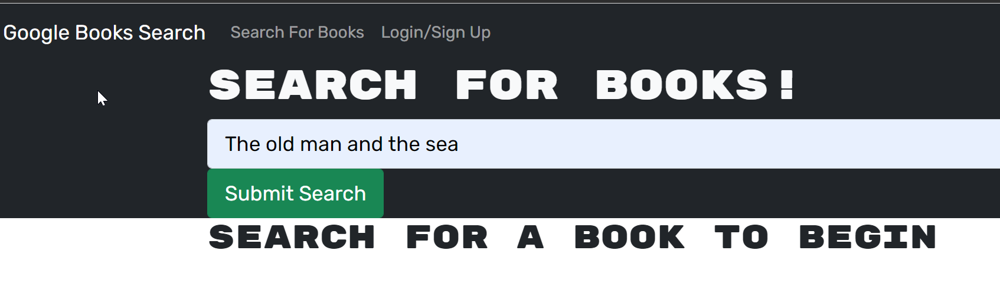

# <googlebooks-app>
## Description
This project had the objective of turning a restful api application into a graphql-apollo application with front and back-end architectures.
## Table of Contents (Optional)
If your README is long, add a table of contents to make it easy for users to find what they need.
- [Installation](#installation)
- [Usage](#usage)
- [Credits](#credits)

## Installation
This app can be found through this [GitHub repostory](https://github.com/jmarq019/googlebooks-app)
## Usage
The user can search for books and save them. The user can also delete their saved books.

## Credits
Credits to the UW instructional team for poviding the knowledge required to build this app. Also credit to stack overflow, which was used as reference for debuggin errors.
